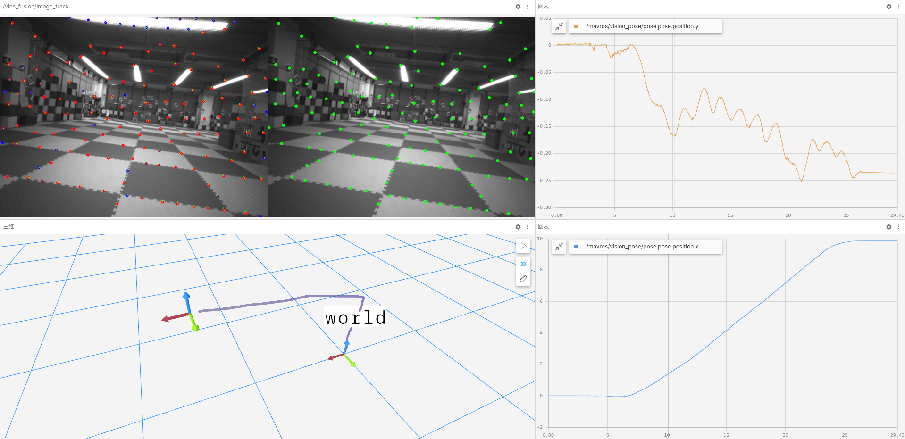

算法可视化与评估
=======================

**本篇目标：使用 Foxglove 工具，实现远程可视化无人机算法结果并用于评估**

.. note::

    无人机电脑默认预装 Foxglove，并且在执行无人机初始化脚本时自动启动。

    你只需要在自己的电脑上安装 Foxglove ，点击鼠标，即可轻松实现无人机状态的可视化

Foxglove 是一款优秀的ROS可视化工具，将许多常用的可视化功能集成在一起，且支持网络数据推流。对于无人机远程查看和调试非常友好。

Foxglove 介绍：https://docs.foxglove.dev/docs/introduction/

在用户电脑进行可视化
------------------------

1、下载 Foxglove 工具： `https://foxglove.dev/download <https://foxglove.dev/download>`_ 

2、打开 Foxglove 工具，测试 Demo：

.. TODO(Derkai): 这里需要做一下示例的完整演示

这里提供了一个测试用的Demo，你可以下载这个ros包用于可视化

.. TODO(Derkai): 需要上传那个demo的bag包，5秒的直线手持拿起放下的

   Vins-Fusion 在 Foxglove 的结果图

打开 Foxglove，添加以下话题即可看到上图:

1、使用 `图像` 界面，查看话题 `/vins_fusion/image_track`, 如左上面板所示。

2、使用 `三维` 界面，查看话题 `/vins_fusion/path`, 如左下面板所示。

3、使用 `图表` 界面，查看话题 `/mavros/vision_pose.pose`, 如右侧面板所示。

.. TODO(Derkai): 这里可以录一个 ROS 包，用于 Foxglove 示例教程。

常见问题
------------------------

**Q：数据显示很卡**

A：可能受限于网络环境，在传输高频图像数据会产生卡顿，可以通过不显示图像信息来缓解。