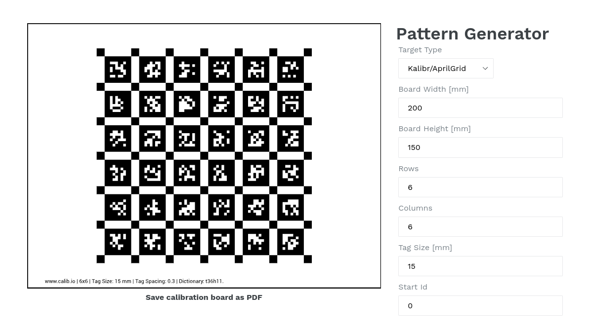
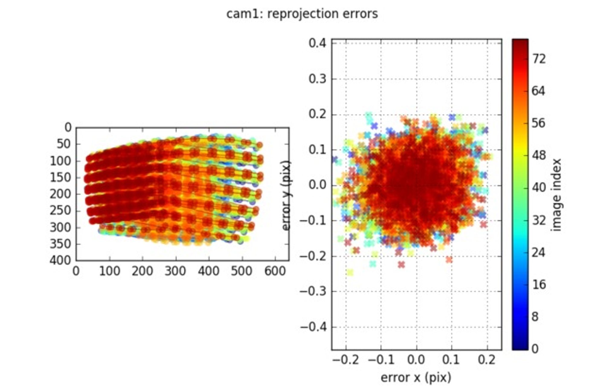
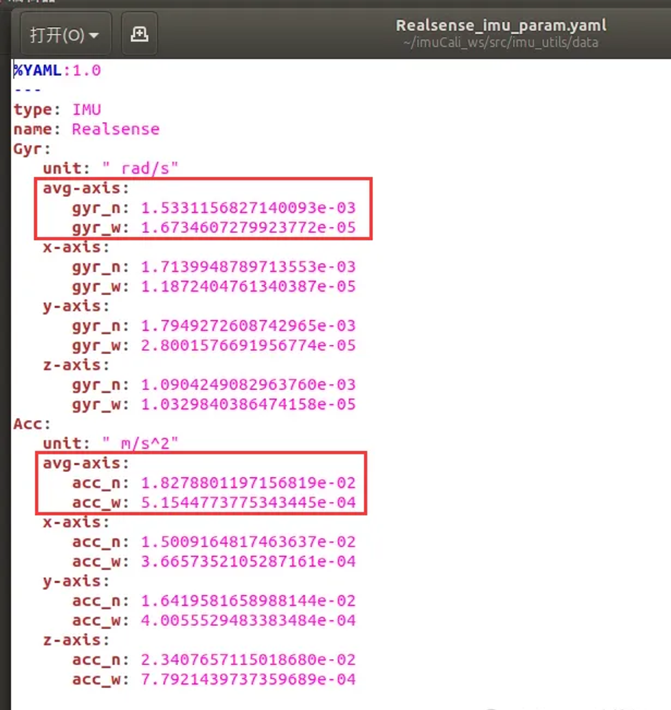
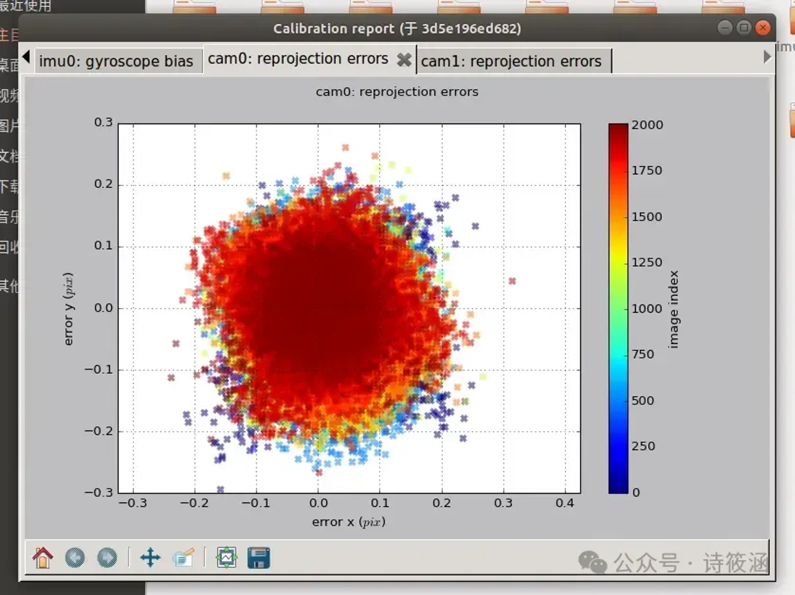
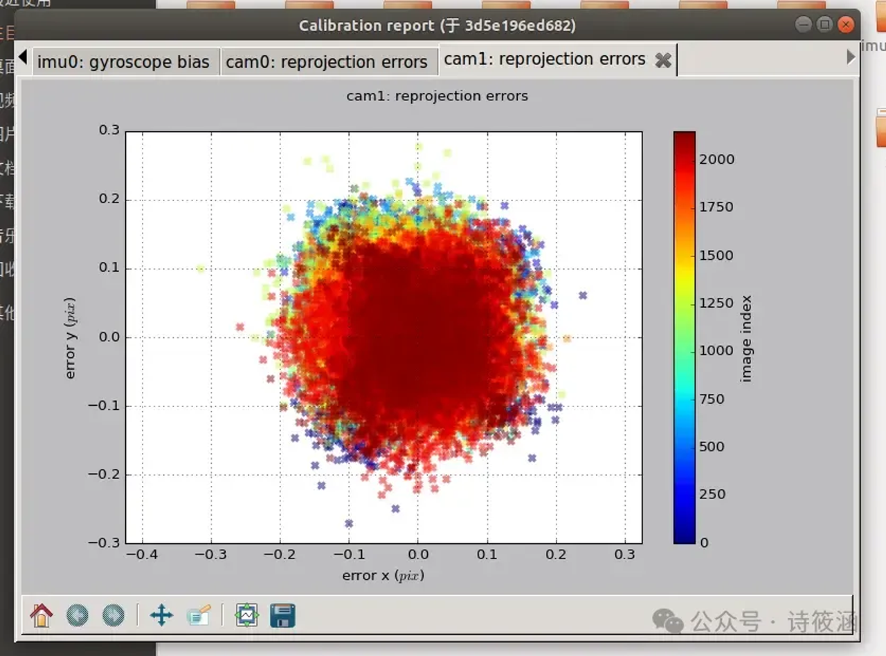

传感器标定
==============================================

.. note::
    本示例使用 Kalibr 工具进行无人机 相机-IMU 联合标定

对无人机上的相机和IMU（惯性测量单元）进行 **联合标定** 的目的是为了获取多传感器精确的内、外参，从而能将两者的数据进行精确融合，以此提高无人机在定位、导航、姿态估计以及环境感知等任务中的精度和可靠性。

确保无人机飞控和相机都安装好并通电能正常使用后，按下列步骤进行：

相机标定
----------------------------------------------

**1、准备标定板**

通过这个网站生成标定板图案： https://calib.io/pages/camera-calibration-pattern-generator

新建一个 yaml 文件，这里命名为 `april_6x6_24x24mm.yaml` ,参数以 **标定板实物测量为准** , 填写以下参数并点击生成：

.. code-block:: bash

    target_type: 'aprilgrid' # 标识码类型
    tagCols: 6               # 标识码列数
    tagRows: 6               # 标识码行数
    tagSize: 0.015           # 标识码边长 [m]
    tagSpacing: 0.3          # 标识码边长与标识码间隔边长的比例
    # example: tagSize=0.015m, spacing=0.5m --> tagSpacing=0.3

**2.录制相机图像包**

可以 `自定义 RealSense 相机 launch 启动文件 <./diy_camera_config.html>`_ 给 D430 相机专用。

.. code-block:: bash

    # 启动相机
    roslaunch realsense2_camera rs_camera_d430.launch

    # 注意打开两个 rqt_image_view 同时查看两个摄像头的图像，保证标定板在两个摄像头图像里面。
    rqt_image_view

    # 更改图片发布的频率并发布到指定话题，打开两个终端，分别执行：
    # 通常设备采集的频率为 20-60 hz, 这会使得标定的图像过多, 而导致计算量太大. 将topic的频率降低到 4hz 左右进行采集.
    rosrun topic_tools throttle messages /camera/infra1/image_rect_raw 4.0 /infra_left
    rosrun topic_tools throttle messages /camera/infra2/image_rect_raw 4.0 /infra_right

录制包操作细节：D435i静止，标定板移动。四个维度移动，前后左右上下及倾斜。

.. code-block:: bash

    # 录制相机bag包
    rosbag record /infra_left /infra_right -O images.bag

    # 标定相机内参和相机间外参
    rosrun kalibr kalibr_calibrate_cameras --target april_6x6_24x24mm.yaml --bag images.bag --bag-from-to 5 30 --models pinhole-radtan pinhole-radtan --topics /infra_left /infra_right --approx-sync 0.14 

**3.相机标定评估**

标定完后会生成三个文件，一个 pdf,一个 yaml，一个 txt。
等待片刻后结果将自动可视化显示，保证所有相机重投影误差在 0.1~0.2 以内，标定结果较好，如下所示。

相机标定输出会保存在文件夹下，示例：

.. code-block:: yaml

    cam0:
    cam_overlaps: [1]
    camera_model: pinhole
    distortion_coeffs: [0.962084349711143]
    distortion_model: fov
    intrinsics: [334.23991339518517, 333.6035571693483, 368.20264278064553, 252.393048692916]
    resolution: [752, 480]
    rostopic: /stereo/left/image_raw
    cam1:
    T_cn_cnm1:
    - [0.9999904159643447, 0.0026734233431591698, -0.003467100673890538, -0.1172292375035688]
    - [-0.002666210133778015, 0.999994275307285, 0.002083428947247444, 0.0001658846059485747]
    - [0.003472650713385957, -0.002074164960638575, 0.9999918192349059, -0.0002328222935304919]
    - [0.0, 0.0, 0.0, 1.0]
    cam_overlaps: [0]
    camera_model: pinhole
    distortion_coeffs: [0.9617138563016285]
    distortion_model: fov
    intrinsics: [330.66005261900216, 330.07191301082963, 371.03802575515203, 231.03601204806853]
    resolution: [752, 480]
    rostopic: /stereo/right/image_raw

IMU标定
----------------------------------------------

.. code-block:: bash

    git clone https://github.com/gaowenliang/imu_utils.git

    # 安装依赖项
    sudo apt-get install libdw-dev

    # 新建一个 fcu_imu.launch 文件，用于飞行棋适配的飞控，写入以下内容
    # TODO(Derkai):需要写入以下内容

.. code-block:: bash

    # 1.启动飞控IMU，运行后静置飞机在水平面两小时以上
    # 连上飞控后启动，可以使用 rqt_topic 检查飞控数据是否正常发送
    roslaunch mavros px4.launch
    # 2.录制IMU数据包
    rosbag record -O x152b_imu /mavros/imu/data_raw
    # 3.标定IMU
    roslaunch imu_utils fcu_imu.launch
    # 新建一个终端以400倍速播放IMU数据
    rosbag play -r 400 x152b_imu.bag

最终会生成一堆文件，只用关注 `yaml` 文件即可，关注角速度和加速度的里面 avg 部分的值即可，就是用红框框出来的这四个：

新建一个 `imu.yaml` 文件，填入红框内的数据，用于接下来的联合标定

.. code-block:: bash

    rostopic: /imu
    update_rate: 200.0 # 以实际IMU采集频率填写(Hz)

    gyroscope_noise_density: 1.5331156827140093e-03
    gyroscope_random_walk: 1.6734607279923772e-05

    accelerometer_noise_density: 1.8278801197156819e-02
    accelerometer_random_walk: 5.154477377534344e-04

联合标定
----------------------------------------------

.. code-block:: bash
        
    # 1.启动相机
    roslaunch realsense2_camera rs_camera_d430.launch
    # 2.打开三个终端分别执行：
    rosrun topic_tools throttle messages /camera/infra1/image_rect_raw 20.0 /infra_left
    rosrun topic_tools throttle messages /camera/infra2/image_rect_raw 20.0 /infra_right
    rosrun topic_tools throttle messages /mavros/imu/data_raw 200.0 /imu
    # 3.注意打开两个 rqt_image_view 同时查看两个摄像头的图像，保证标定板在两个摄像头图像里面。
    rqt_image_view
    # 4.录制 Cam-IMU 包
    # 录制包操作细节：D435i静止，标定板移动。四个维度移动，前后左右上下及倾斜。
    rosbag record -O imu_stereo_20240709.bag /infra_left /infra_right /imu
    # 5.联合标定
    rosrun kalibr kalibr_calibrate_imu_camera --target april_6x6_24x24mm.yaml --cam double_cam_20240709-camchain.yaml --imu imu.yaml --bag imu_stereo_20240709.bag

等待片刻，在生成的 pdf 报告里面，两个相机的重投影误差都小于 0.2 才算可以。如下面两幅图所示。

.. list-table::
   :widths: auto
   :header-rows: 0

   * - |image1|
     - |image2|

.. TODO(Derkai):需要将配置文件保存到专用的配置文件夹里面

至此，通过传感器标定确保了数据源准确，接下来你可以开始 `部署算法并进行测试 <./combinatorial_algorithms.html>`_ 了
