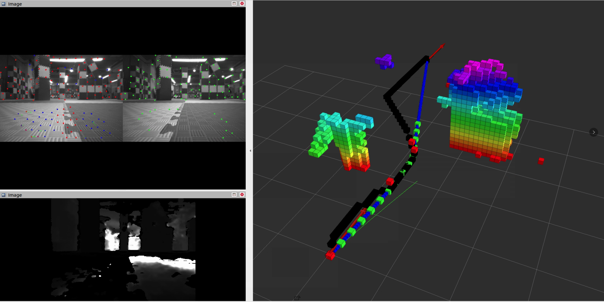

组合你的算法并部署
==============================================

**本篇目标：演示如何通过组合已适配的算法，并进行调参调优后，实现无人机自主避障飞行至预设的目标点**

.. note:: 
    本示例所有操作均在无人机机载电脑环境中完成，可使用 Nomachine 远程连接进行操作

定位模块选用 `Vins-Fusion`，规划模块选用 `Ego-Planner`，控制模块使用 `Emnavi默认控制器（基于PX4）`, 最终效果如下：

.. TODO(Derkai): 这里的结果图需要换成 ego-planner 的而不是 ipc

   Vins-Fusion + Ego-Planner 进行无人机自主飞行可视化图

测试视觉里程计算法 Vins-Fusion
------------------

.. code-block:: bash

    bash scripts/kill_one_shot.sh # 确保之前的程序已经关闭
    bash scripts/one_shot_single.sh # 初始化无人机（mavros、控制、传感器等节点）
    bash src/vins_fusion/vins_fusion_run.sh # 启动 Vins-Fusion 里程计算法。等待几秒，Vins-Fusion 初始化完成

当终端提示 `Initialization finish!` 时，表明VINS初始化完成。

缓慢拿起无人机，在纹理充足的场地中慢速（<1m/s）走一段距离,一般可以通过绕场地一圈回到出发点，观察 Vins-Fusion 输出的里程计结果值，来判断内外参是否足够准确。

.. code-block:: bash

    rostopic echo /quadrotor_control/odom # 查看vins当前的位姿估计

观察输出结果，观察position下的 x、y、z（相对于出发点的位置值）

.. code-block:: bash

    position: # 应尽量都接近于0（单位m），我们测试的效果是无人机累计移动10m，里程计误差应 < 0.1m
        x: 0.001063267595719554
        y: -6.500945938429109e-05 # e-5 是十的负5次方
        z: -0.0006057745869551787
    orientation: 
        x: 0.01049433684918284
        y: 0.033035392063272676
        z: -0.0002442503311311833
        w: 0.9993990568594147
        ...............

若认为标定的误差大，还可以选择开启 Vins-Fusion 的内外参自动优化。优化后的结果将会保存至 `src/core/global_interface/config/drone_param.yaml` 中以供使用。

.. code-block:: yaml

    # 修改 realsense_stereo_imu_config.yaml
    estimate_extrinsic: 1 # 当标定的内外参误差较大，只能给出粗略的值时，开启内外参自动优化

若上一步是通过开启外参自动优化得到的结果，且评估外参足够可用时，可固定外参，供后续使用

.. code-block:: yaml

    # 修改 realsense_stereo_imu_config.yaml
    estimate_extrinsic: 0

再次验证是否可用，当 Vins-Fusion 初始化完成后以较快的速度 1~2m/s 的速度绕场地走一圈，回到原点后查看 Vins-Fusion 的位置估计是否在可接受的误差范围以内，若不满足需要重新标定外参。

.. code-block:: bash

    bash scripts/kill_one_shot.sh # 确保之前的程序已经关闭
    bash scripts/one_shot_single.sh # 初始化无人机（mavros、控制、传感器等节点）
    bash src/vins_fusion/vins_fusion_run.sh # 启动 Vins-Fusion 里程计算法。等待几秒，Vins-Fusion 初始化完成

设置规划算法 Ego-Planner 目标点
------------------

Ego-Planner 规划算法输入相机的深度图、目标点和里程计信息，通过深度图生成占据栅格地图，并实时生成局部飞行轨迹，在飞向目标点的过程中实时避障。

本示例读取配置文件中的目标点进行目标点发布，目标点信息存储在
:code:`/src/task/ego_planner_swarmv1/src/planner/plan_manage/launch/real_env/swarm_all_in_one.launch`
中，其文件片段如下所示(在第70行左右)，设置 5 个目标点，无人机起飞后，将依次到达这些点。

.. warning::

    目标点需根据实际场地修改，避免飞到危险的地方

.. code-block:: xml

    <!-- 预设目标点数 -->
    <arg name="point_num" value="5" />

    <!-- 目标点为相对里程计初始化点的x、y、z坐标，单位 m -->
    <arg name="point0_x" value="1.0" />
    <arg name="point0_y" value="0.0" />
    <arg name="point0_z" value="1.0" />

    <arg name="point1_x" value="2.0" />
    <arg name="point1_y" value="0.0" />
    <arg name="point1_z" value="1.0" />

    <arg name="point2_x" value="3.0" />
    <arg name="point2_y" value="0.0" />
    <arg name="point2_z" value="1.0" />

    <arg name="point3_x" value="4.0" />
    <arg name="point3_y" value="0.0" />
    <arg name="point3_z" value="1.0" />

    <arg name="point4_x" value="0.0" />
    <arg name="point4_y" value="0.0" />
    <arg name="point4_z" value="1.0" />

飞行实验
------------------

在根据当前场景修改了 Ego-Planner 目标点信息并确保无人机可达后，就可以开始飞行测试了：

.. code-block:: bash

    # 无人机初始化
    bash scripts/one_shot_single.sh 
    # 起飞，等待片刻飞机将起飞
    bash scripts/take_off.sh
    # 当飞机起飞定高稳定后，再运行 ego-planner
    bash scripts/run_ego_v1.sh
    # 当 ego-planner 运行结束后进行降落
    bash scripts/land.sh 
    # 关闭所有程序
    bash scripts/kill_one_shot.sh

常见问题
------------------

**Q: 启动 Vins-Fusion 节点后，一直卡在初始化。**

A: 检查IMU和相机数据是否正常输入，或检查填入的相机-IMU内外参是否有误：

.. code-block:: bash

    # 可以使用 rostopic 检查以下节点数据
    /mavros/imu/data # 通常 IMU 话题发布频率需要在100Hz以上
    /rs_camera/infra_left/data # 检查左右两相机话题发布频率是否在 15Hz 以上
    /rs_camera/infra_right/data

**Q: Vins-Fusion 明显漂移或跑崩**

A: 可能的原因包含：

.. code-block:: text

    1、相机-IMU 外参误差大，需要重新标定。
    2、由于其他程序对计算资源的挤占，视觉前端更新频率过低，导致后端无法进行正常优化
    3、存在高机动运动，或长时间段内没有稳定的纹理用于前端特征提取。
    4、Vins-Fusion 是假设静态场景进行里程估计的，不适用画面存在大量的动态物体，且没有做动态物体剔除处理的场景。

**Q: 只给了一个粗糙的外参，但是开启自动优化后依然不准，或直接跑崩。**

A: 可能的原因包含：

.. code-block:: text

    1、检查相机和IMU是否存在明显的结构松动情况
    2、检查所给内外参是否明显的超过实际情况（例如相机到IMU的旋转矩阵在某个轴超过90度），需要重新联合标定相机-IMU
    3、在进行标定自动优化时，注意不要用手或其他东西遮挡摄像头视野；手持绕场进行外参标定时，移动速度不易过快；确保相机画面能观察到足够稳定的场地纹理。

**Q: 无人机在穿越障碍时会撞到障碍物。**

A: 可以通过录制rosbag包离线运行算法或手持无人机到撞机点附近，复现异常场景。可能的原因包含：

.. code-block:: text

    1、无人机飞行太快，Ego-Planner 规划结果还未能完全得到执行或里程计延迟太高
    2、在撞机点附近的深度图，导致生成的点云占据栅格地图出现非理想情况（生成错误或生成缺失）
    通常的做法是调整场地环境（环境灯光、障碍物摆放空间关系）、深度相机参数、点云占据栅格生成参数等来保证该处的规划可行。