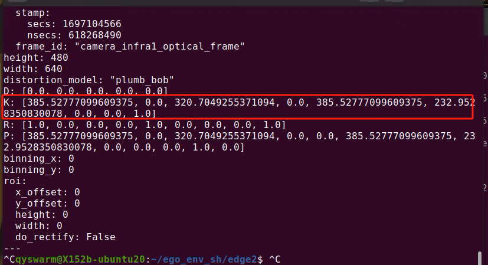
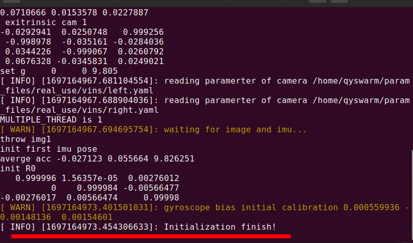

Ego_planner飞行实验
==============================================

ego_planner_v1_all_in_one 中包含了运行ego_planner所需的全部文件.

.. warning::
    以下步骤均需要在Nomachine下完成

.. note::
    当前代码库存储在内部电脑上，外部无法访问，因此非内部使用的机器上均提前下载好了代码，并配置好了环境。后续版本提供下载方式

环境及代码准备
------------------

.. code-block:: bash

    cd ~
    git clone --recursive http://gitlab.qyswarm.top/projects_group/ego_planner_v1_all_in_one.git

安装依赖

.. code-block:: bash

    sudo apt install -y 
    ros-noetic-ddynamic-reconfigure \
    ros-noetic-mavros \
    ros-noetic-mavros-extras \
    ros-noetic-realsense2-camera \
    ros-noetic-foxglove-bridge
    # Find Eigen
    sudo cp -r /usr/include/eigen3/Eigen /usr/include/
    # FIX device ID
    cd ego_planner_v1_all_in_one/Tools/FixDeviceID
    sudo bash fix.sh
    cd ~

.. warning::
    mavros安装完成之后需要手动安装依赖项（国内网可能无法下载）

    .. code-block:: bash

        cd /opt/ros/noetic/lib/mavros
        ./install_geographiclib_datasets.sh

代码编译
------------------

.. code-block:: bash

    cd ~/ego_planner_v1_all_in_one
    catkin_make

代码结构
------------------

.. code-block:: bash

    ├── ego_planner_v1_all_in_one
    │   ├── param_files 存储关键参数(相机参数，ID号等)
    │   │   ├── real_use 使用时程序会读取的参数
    │   │   └── template 参数模板
    │   ├── src
    │   │   ├── autonomous_drone_sdk # 存放一键启动的luanch文件
    │   │   ├── control
    │   │   ├── ego_planner_swarmv1
    │   │   ├── msg_socket_bridge # 多机执行任务时的信息交换
    │   │   └── vins_fusion_d435 # vins
    │   ├── Tools
    │   │   ├── find_config.py # 在real_use中寻找参数
    │   │   └── FixDeviceID # 固定px4 ID、
        以下5个脚本配合以完成在真实场景中运行ego_planner
    │   ├── S_one_shot_single.sh # 启动 mavros, realsense_camera，control 等节点
    │   ├── S_takeoff.sh # 起飞
    │   ├── S_land.sh # 降落
    │   ├── T_run_egoV1.sh # 执行ego_planner
    │   └── S_kill_one_shot.sh # 关闭所有程序

参数设置
------------------

在 :code:`param_files` 中存在两个文件夹，:code:`real_use` 和 :code:`template` ,
现在需要将 :code:`template` 中如下所示文件及文件夹复制到 :code:`real_use` 中

.. code-block:: bash

    ├── drone_param.yaml
    ├── drone_detect
    │   └── depth_camera.yaml
    └── vins
        ├── left.yaml
        ├── right.yaml
        └── vins_with_d435.yaml

修改相机内参
------------------

对于Realsense D430 相机，可在ros中启动realsense节点之后，读取其topic获取内参。具体步骤如下

.. code-block:: bash

    cd ~/ego_planner_v1_all_in_one
    ./S_kill_one_shot.sh # 确保之前的程序已经关闭
    ./S_one_shot_single.sh 
    # 现在，可以通过以下命令查看相机的相关信息（比如内参k）
    rostopic echo /camera/infra1/camera_info
    # 按ctrl+c 退出

K中数据含义如下，param_files 中所有含  fx fy cx cy 都需要修改

.. code-block:: bash

    [fx,0.0,cx,  0.0,fy,cy,  0,0,1]

现在需要修改相机内参，其存储在 :code:`param_files/real_use` 文件夹下的4个地方,如下所示

.. code-block:: bash

    drone_param.py
    vins/right.yaml
    vins/left.yaml
    drone_detect/depth_camera.yaml

修改 相机-IMU 外参
------------------

.. note::
    外参标定时需要 **电池上电** ，并将飞机放入场地中

创建一个文件夹用于存储外参

.. code-block:: bash

    mkdir -p ~/vins_output
    #### 之后的外参自动标定的结果会存储在 ~/vins_output/extrinsic_parameter.txt 中。

现在修改 :code:`param_files/vins/vins_with_d435.yaml` 中的参数

.. code-block:: yaml

    estimate_extrinsic: 1 # 1 为vins在运行时自动标定外参

现在开启VINS

.. code-block:: bash

    cd ~/ego_planner_v1_all_in_one
    ./S_kill_one_shot.sh # 确保之前的程序已经关闭
    ./S_one_shot_single.sh # S_one_shot_single.sh 中包含了vins的启动
    # 等待vins初始化完成

当看到如下所示信息时，vins初始化完成

缓慢拿起无人机，在场地中走一段时间，(越慢效果越好)，无人机会自动生成外参,一般可以通过绕场地一圈回到原点后vins的位置xyz的估计误差来判断外参估计是否足够准确。

.. code-block:: bash

    rostopic echo /quadrotor_control/odom # 查看vins当前的位姿估计

可以看到如下片段

.. code-block:: bash

    header: 
    seq: 4403
    stamp: 
        secs: 1697162412
        nsecs: 746027708
    frame_id: "world"
    child_frame_id: ''
    pose: 
    pose: 
        position: # 注意下面三行 ，所有值应尽量接近与0，最好在每个都在 0.1m 以内，0.2m也勉强接受
        x: 0.001063267595719554    
        y: -6.500945938429109e-05 # e-5 是十的负5次方
        z: -0.0006057745869551787
        orientation: 
        x: 0.01049433684918284
        y: 0.033035392063272676
        z: -0.0002442503311311833
        w: 0.9993990568594147
    ...............

觉得当前的外参合适时 (经验值是 xyz 的估计误差均在 0.2 m以内)，从extrinsic_parameter.txt中,复制 :code:`body_T_cam0` 和 :code:`body_T_cam1` 相关字段覆盖 :code:`param_files/vins/vins_with_d435.yaml` 中对应字段。

接下来修改 :code:`param_files/vins/vins_with_d435.yaml` 中参数以使得vins固定外参

.. code-block:: bash

    estimate_extrinsic: 0

现在重新执行 S_one_shot_single.sh ，初始化完成后以较快的速度 1m/s~2m/s的速度绕场地走一圈，在原点后查看vins的位置估计是否在30cm以内，若不满足需要重新标定外参。

设置ego_planner目标点
------------------

ego_planner的本质是打点飞行，在飞向目标点的过程中实时避障。源码中提供了两种方式(Rviz交互打点和读取配置文件中的目标点)，在此，展示读取配置文件中的目标点的方法，打点信息存储在
:code:`ego_planner_v1_all_in_one/src/ego_planner_swarmv1/src/planner/plan_manage/launch/real_env/Swarm_all_in_one.launch`
中，其文件片段如下所示(在第70行左右)

.. code-block:: xml

	<!-- 生效点数  -->
    <arg name="point_num" value="5" />

    <arg name="point0_x" value="12.0" />
    <arg name="point0_y" value="2.0" />
    <arg name="point0_z" value="0.7" />

    <arg name="point1_x" value="12.0" />
    <arg name="point1_y" value="-2.0" />
    <arg name="point1_z" value="0.7" />

    <arg name="point2_x" value="10.0" />
    <arg name="point2_y" value="-4.0" />
    <arg name="point2_z" value="0.7" />

    <arg name="point3_x" value="8.0" />
    <arg name="point3_y" value="-1.0" />
    <arg name="point3_z" value="0.7" />

    <arg name="point4_x" value="0.0" />
    <arg name="point4_y" value="0.0" />
    <arg name="point4_z" value="0.7" />
    
    <arg name="point5_x" value="0.0" />
    <arg name="point5_y" value="0.0" />
    <arg name="point5_z" value="1.0" />

    <arg name="point6_x" value="0.0" />
    <arg name="point6_y" value="0.0" />
    <arg name="point6_z" value="1.0" />

以上内容可根据实际情况修改。

实验
------------------

在根据当前场景修改了打点信息并确保相机内外参没有问题后，现在可以开始测试了,在 :code:`ego_planner_v1_all_in_one` 中有5个脚本，分别为

.. code-block:: bash

    ├── S_one_shot_single.sh  # 开启必要的驱动，相机，飞控等
    ├── S_takeoff.sh # 起飞
    ├── T_run_egoV1.sh # 运行ego_planner
    ├── S_land.sh # 降落
    └── S_kill_one_shot.sh # 关闭上述所有脚本开启的进程

使用流程

.. code-block:: bash

    # 在开始时
    cd ~/ego_planner_v1_all_in_one
    ./S_one_shot_single.sh 
    # 等待开启完成后，缓慢拿起无人机，在空中缓慢转一圈，然后放回原位（vins会自动估计相机和imu采样的时间间隔TD，直接起飞有一定概率使得其估计错误，因此需要缓慢移动使其估计收敛）
    # 查看里程计频率，应该为200hz 左右
    rostopic hz /quadrotor_control/odom
    # 查看里程计信息，xyz 应均为0
    rostopic echo /quadrotor_control/odom
    # 起飞
    ./S_takeoff.sh
    # 运行 ego_planner
    ./T_run_egoV1.sh
    # 当ego_planner运行结束后
    ./S_land.sh
    ./S_kill_one_shot.sh # 关闭所有程序
