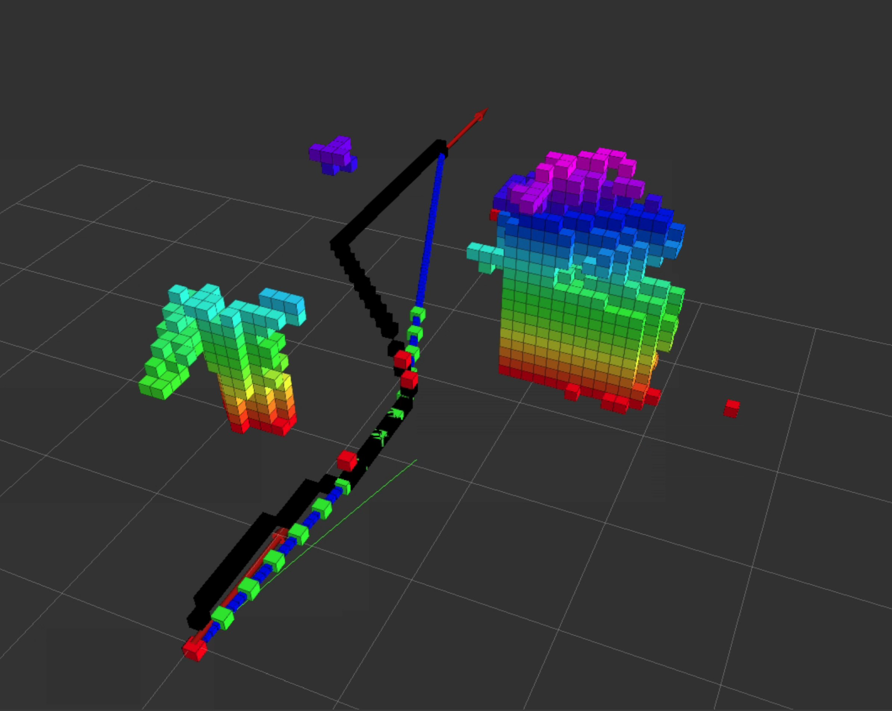

IPC 规划控制算法
==============================================

环境配置与模块编译
----------------------------------------------

.. code-block:: bash

    # 进入 X152b 项目目录执行
    bash scripts/ipc_setup.sh

使用
----------------------------------------------

.. code-block:: bash

    # 进入 X152b 项目目录执行
    bash scripts/ipc_run.sh

调参建议
----------------------------------------------

**第一阶段：选择无障碍的开阔地，确保无人机能平稳直线飞到指定位置悬停**

.. code-block:: bash

    # 修改 IPC 配置文件 param.yaml
    roscd ipc/config
    vim param.yaml

.. code-block:: bash

    # 设置起飞后第一个悬停目标点，可以不用太高防止炸机（单位 m）
    goal_x:        0
    goal_y:        0
    goal_z:        0.3

    yaw_ctrl_flag: false # 关闭

    # 1、调整悬停油门估计：可以先关闭油门估计，使用手动估计的油门值，并且对油门速度做一下限制，避免飞机起飞后直接炸机。
    thrust_limit:  0.5      # 最大悬停油门值
    hover_esti:    false    # 是否使用IPC内置的悬停油门估计算法
    hover_perc:    0.374    # 悬停油门值

    # 2、对速度、加速度等进行约束(m/s)
    vx_min:     -2.0
    vy_min:     -2.0
    vz_min:     -2.0
    vx_max:      2.0
    vy_max:      2.0
    ...

    # 3、调整MPC参数：对于X152b机型，参数可按数量级调整，若当前参数使得飞机机动过快，可以往小调整一个数量级，直到稳定（过小可能会处于难收敛的状态）
    # 这里给出一个 X152b机型 可用的示例
    R_p:         10.0  # 1000.0->10.0
    R_v:         0.0
    R_a:         0.0
    R_u:         0.0
    R_u_con:     0.2
    R_pN:        5.0   # 2000.0->5.0
    R_vN:        2.0   # 1000.0->2.0
    R_aN:        2.0   # 1000.0->2.0

.. TODO(Derkai): 这里缺几张动图或者短视频用于展示不同参数的影响

**第二阶段：摆放单块规则障碍物，确保无人机能平稳进行避障**

常见问题
----------------------------------------------

**Q: 飞行时出现高频晃动**

A: 可以通过录制rosbag包离线运行算法或手持无人机到规划异常附近，复现异常场景。可能的原因包含：

.. code-block:: text

    1、MPC参数过于激进，可尝试调小一些，先从慢收敛再逐步回调到合适的收敛速度
    2、路径决策出现频繁的切换

**Q: 没有按照设想中的路径稳定飞行，经常出现大转弯**

A: 需要检查在路径频繁切换点附近，是否占据栅格点云发生了缺失或突现，导致路径被改，优化方向可包括：

.. code-block:: text
    
    1、获取更可用的点云占据栅格地图（调整深度相机参数、调整占据栅格点云生成参数、膨胀系数等），确保路线可达
    2、在算法中添加约束条件（例如地图边界、A*搜索参数等），确保飞机在进行路径决策时不会选择过偏远的路线

