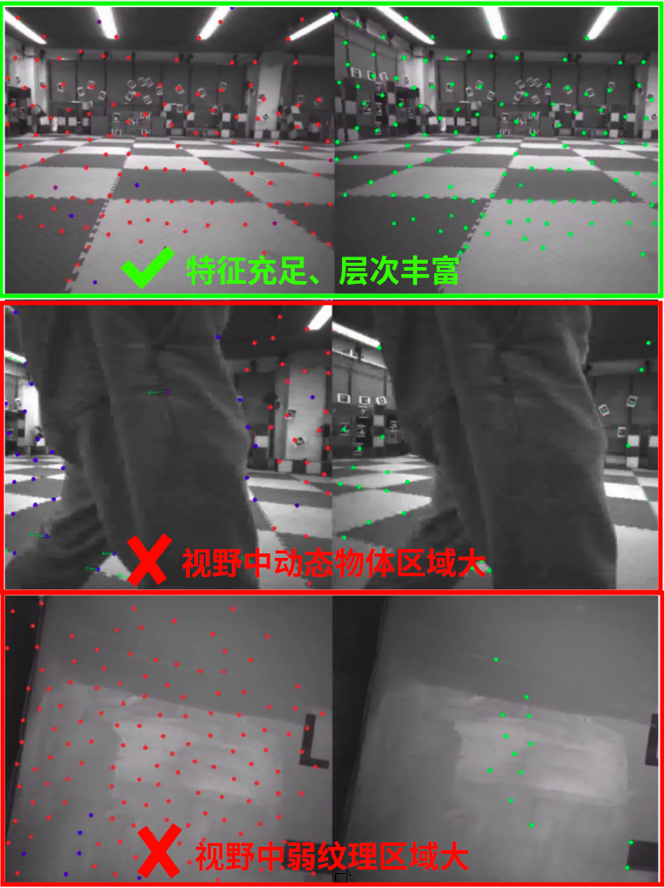
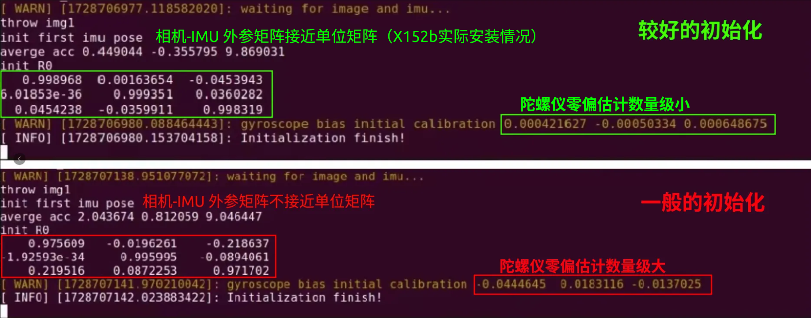

Vins-Fusion 视觉里程计
==============================================

.. TODO(Derkai): 需要解决视频无法播放的问题
.. raw:: html

    <video width="600" controls>
      <source src="_static/vins_fusion_demo.mp4" type="video/mp4">
      Your browser does not support the video tag.
    </video>

环境配置与模块编译
----------------------------------------------

.. code-block:: bash

    # 进入 X152b 项目根目录执行
    bash src/vins_fusion/vins_fusion_setup.sh

当终端提示 `Vins-Fusion setup completed successfully!` 时，表明 Vins-Fusion 安装配置完成。

算法使用
----------------------------------------------

接下来，可以将无人机放置在平稳的地方，且相机视角方向有足够静态特征的场景（不推荐在过暗、过曝、少纹理、运动物体多等地方），如下图所示：

   Vins-Fusion 里程计算法推荐的使用场景

当无人机放置好后，可以运行算法了。

.. code-block:: bash

    # 进入 X152b 项目根目录执行
    # 初始化无人机
    bash scripts/one_shot_single.sh
    # 启动 Vins-Fusion 视觉里程计
    bash src/vins_fusion/vins_fusion_run.sh

当终端提示 `Initialization finish!` 时，表明 Vins-Fusion 初始化完成，如下图所示：

   Vins-Fusion 初始化结果参考

可视化与评估
----------------------------------------------

**通过查看里程计结果坐标值来初步评估定位精度**

.. code-block:: yaml

    # 终端显示里程计结果坐标值（单位：m）
    rostopic echo /mavros/vision_pose/pose.pose.position

然后用手缓慢拿起无人机，在纹理充足的场地中慢速（ <1m/s）走一段距离,一般可以通过绕场地一圈回到出发点，观察结果值是否与初始值接近。如果偏差能控制在 cm 数量级，则表明 Vins-Fusion 运行良好。

**或使用 Foxglove 可视化查看数据**

.. figure:: ./assets/vin_fusion_demo.png
   :alt: Vins-Fusion 在 Foxglove 的结果图
   :scale: 40%
   :align: center

   Vins-Fusion 在 Foxglove 的结果图

算法运行过程中，打开 Foxglove，添加以下话题即可看到上图:

1、使用 `图像` 界面，查看话题 `/vins_fusion/image_track`, 如左上面板所示。

2、使用 `三维` 界面，查看话题 `/vins_fusion/path`, 如左下面板所示。

3、使用 `图表` 界面，查看话题 `/mavros/vision_pose.pose`, 如右侧面板所示。

.. TODO(Derkai): 这里缺几张动图或者短视频用于展示不同参数的影响

常见问题
----------------------------------------------

**Q: 初始化失败，终端提示** `feature tracking not enough, please slowly move you device`

A: 初始化阶段相机视野中可用于跟踪的特征点过少，需要将无人机放置相机视角方向有足够静态特征的场景（不推荐在过暗、过曝、少纹理、运动物体多等地方）中重新运行。 

**Q: 初始化完成后，依然会出现里程计飘的问题**

A: 可以根据现象一步步排查

1、如果是初始化后，静止不动都会直接飘了，需要看是否有（动态物体、频闪的光源等）大量存在于相机视野中，这些会导致 Vins-Fusion 认为场景在运动；

2、也可能是初始化过程中，即IMU预积分阶段时，无人机处于非静止状态，放大了无人机陀螺仪噪声估计误差。

3、可能是内外参关系与实际情况相差过大。需要检查相机和飞控是否牢固，排除因为摔飞机导致结构位移。或者需要重新标定内外参信息。