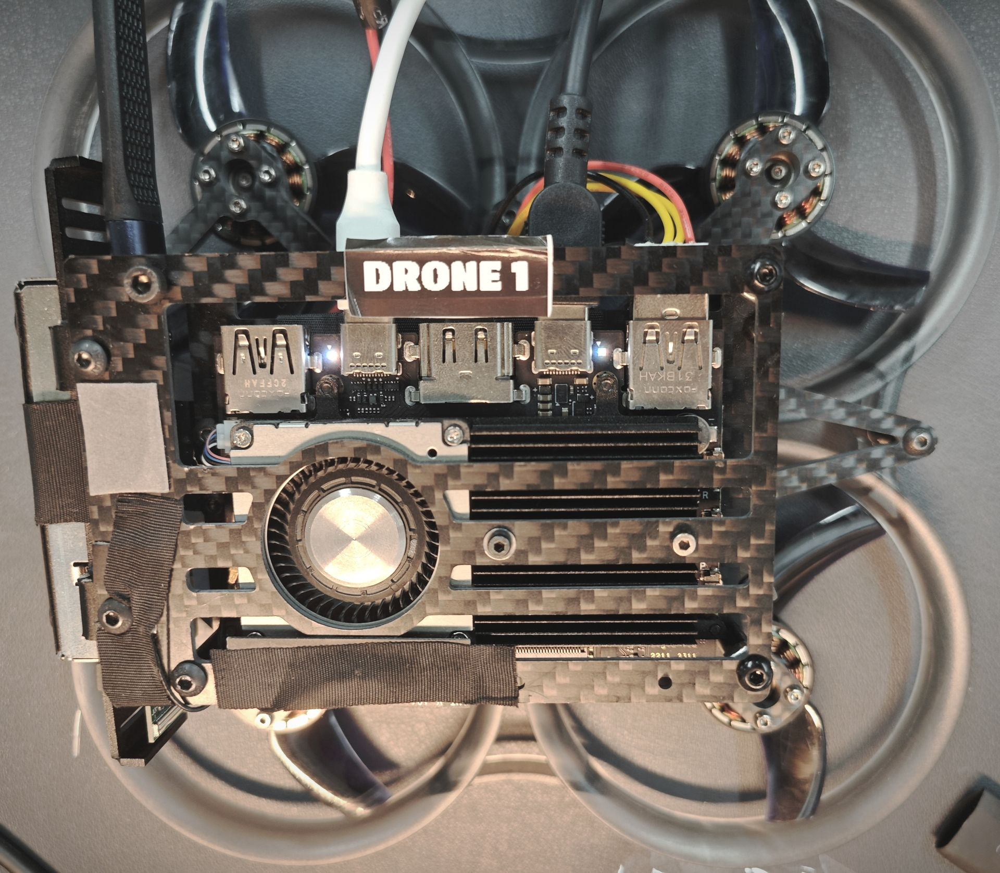
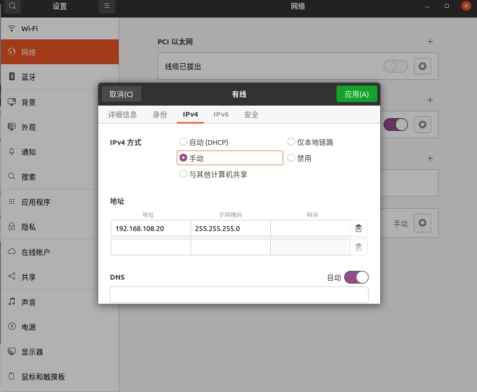
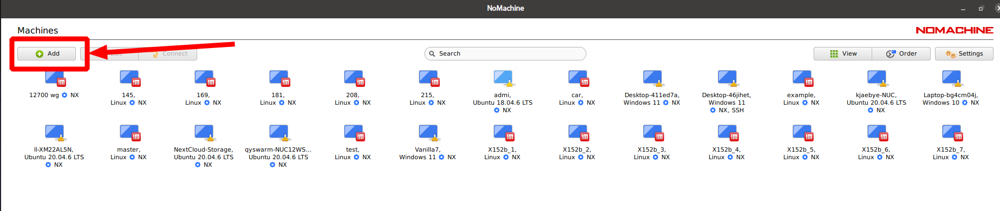
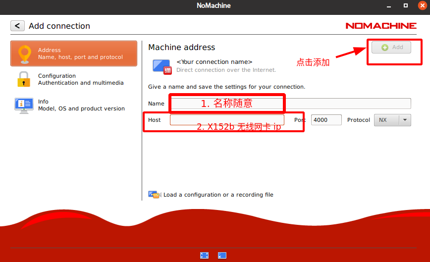

配置电脑系统
===============

**本篇目标：完成 X152b 无人机电脑 Ubuntu 系统配置，并能对其远程访问**

.. note:: 
    首次开箱 X152b 无人机，电脑里面无系统，需要 `烧录 emnavi 预设的 Ubuntu 系统镜像 <../questions_and_answers/write_image.html>`_

.. TODO(Derkai): 需要解决视频无法播放的问题
.. raw:: html

    <video width="600" controls>
      <source src="_static/vins_fusion_demo.mp4" type="video/mp4">
      Your browser does not support the video tag.
    </video>

系统账户信息
----------

连接键鼠、显示器和电源，首次进入系统，X152b 的默认系统账户信息如下:

.. list-table::
   :widths: 5 30
   :align: left
   :header-rows: 1

   * - **用户名**
     - **默认密码**
   * - emnavi
     - 123456

首次连接 Wifi
-----------

另外准备一台计算机（主机），通过USB虚拟局域网有线直连 X152b 机载电脑。

如下图所示，将物料包中的两根线分别插在 **对应的位置** 上。

* 黑色线为供电线(需要从PD充电器取电)，当机载电脑上的灯由绿色转变为白色时，表明系统已启动

* 白色线为数据线，需要拔掉 RealSense D430 的数据线，换成这根线。另一端连接主机

此时主机上会新增一个USB以太网连接，手动设置主机IPv4地址为同一网段，参考如下：

.. note::
  无人机机载电脑USB网口的默认IP设置为 192.168.108.1

.. list-table::
   :widths: 5 30
   :align: left
   :header-rows: 1

.. code-block:: bash

    # 验证网络是否能到机载电脑，在主机上执行
    ping 192.168.108.1

确保联通成功后，接下来可通过 SSH 连接至机载电脑

.. code-block:: bash

    # 通过SSH连接到机载电脑，在主机上执行。默认机载电脑用户密码为123456
    ssh emnavi@192.168.108.1
    

通过 SSH 连接到机载电脑后，可以通过 `nmcli` 命令连接 wifi

.. code-block:: bash

    # 搜索网络
    sudo nmcli device wifi list
    # 连接网络
    sudo nmcli device wifi connect 要连接的wifi名 password wifi密码
    # 查看已有的连接
    nmcli connection show

    # 连接 wifi 成功后，查看机载电脑 IP 地址，方便下一步配置 Nomachine
    ifconfig

首次使用 Nomachine 连接至无人机
-----------------------

当无人机没有接入显示器（例如飞行中、离线调试时），想要进行代码的运行和可视化显示，需要通过 Nomachine 连接到无人机。

在主机上启动 Nomachine，如下图所示进行初次连接配置：

至此，你已经完成了 X152b 无人机电脑系统配置，并能对其远程访问，下一步你可以进行常用算法的部署和飞行。