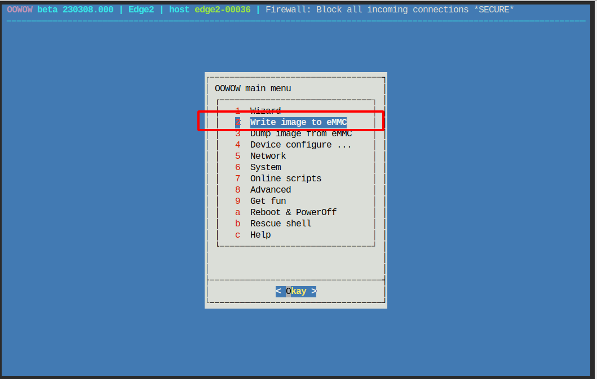
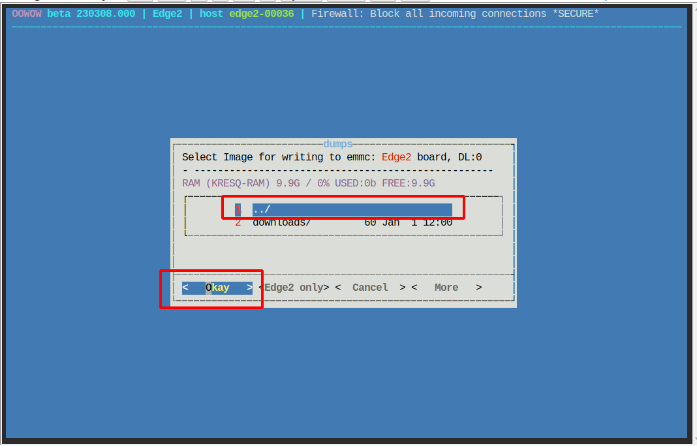
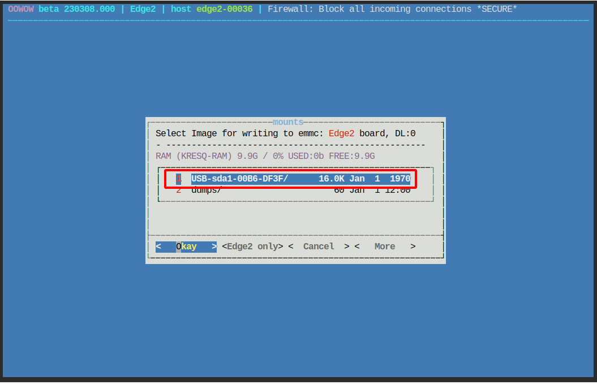

镜像烧录
==============================================

镜像地址 http://10.42.0.180/webdav/X-152b_image_zip/

用usb线连接电脑
启动电脑后，按住Function键并短按reset键进入 oowow
在浏览器中使用 http://172.22.1.1/x/control  进入控制界面

现在执行以下步骤

