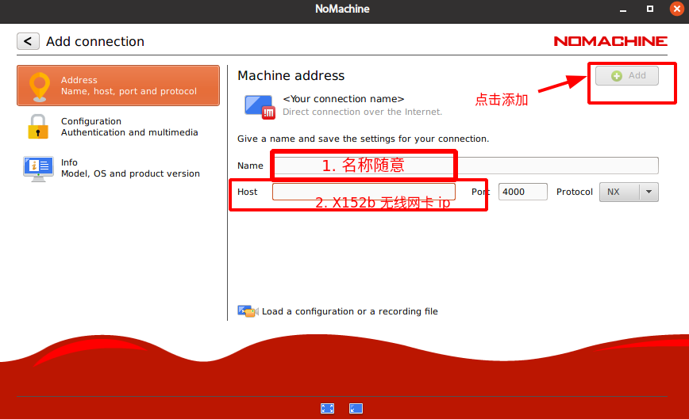

配置电脑系统
===============

**本篇目标：完成 X152b 无人机电脑 Ubuntu 系统配置，并能对其远程访问**

.. note:: 
    首次开箱 X152b 无人机，电脑里面无系统，需要 `烧录 emnavi 预设的 Ubuntu 系统镜像 <./write_image.html>`_

系统账户信息
----------

首次进入系统，X152b 的默认系统账户信息如下:

.. list-table::
   :widths: 5 30
   :align: left
   :header-rows: 1

   * - **用户名**
     - **默认密码**
   * - emnavi
     - 123456

修改无人机网络主机名、用户名及密码
-------------------

.. note::
  本示例将默认的用户名 khadas 改为 emnavi ,将默认的网络主机名 khadas 改为 X152b-ubuntu20

1、修改网络主机名

.. code-block:: bash

  sudo gedit /etc/hosts

把两个 Khadas 改成 x152b-ubuntu20

.. image:: ./assets/change_host.png
  :width: 600
  :alt: Alternative text

2、修改用户名

.. code-block:: bash

  sudo su
  vim /etc/passwd 找到当前用户名并修改
  vim /etc/shadow 找到当前用户名并修改
  vim /etc/group 找到所有当前用户名并修改
  reboot

重启之后就是新的用户名了，接下来更改密码，主机名，以及用户根目录名

.. code-block:: bash

  # 更改用户根目录名
  sudo mv /home/Khadas /home/emnavi
  # 更改网络主机名
  sudo hostnamectl set-hostname x152b-ubuntu20
  # 更改密码
  sudo passwd emnavi

首次连接 Wifi
-----------

另外准备一台计算机（主机），通过USB虚拟局域网有线直连 X152b 机载电脑。

如下图所示，将物料包中的两根线分别插在 **对应的位置** 上。

* 黑色线为供电线(需要从PD充电器取电)，当机载电脑上的灯由绿色转变为白色时，表明系统已启动

* 白色线为数据线，需要拔掉 RealSense D430 的数据线，换成这根线。另一端连接主机

.. image:: ./assets/wiring.png
  :width: 600
  :alt: Alternative text

此时主机上会新增一个USB以太网连接，手动设置主机IPv4地址为同一网段，参考如下：

.. note::
  无人机机载电脑USB网口的默认IP设置为 192.168.108.1

.. list-table::
   :widths: 5 30
   :align: left
   :header-rows: 1

.. code-block:: bash

    # 验证网络是否能到机载电脑，在主机上执行
    ping 192.168.108.1

确保联通成功后，接下来可通过 SSH 连接至机载电脑

.. code-block:: bash

    # 通过SSH连接到机载电脑，在主机上执行。默认机载电脑用户密码为123456
    ssh emnavi@192.168.108.1
    

通过 SSH 连接到机载电脑后，可以通过 `nmcli` 命令连接 wifi

.. code-block:: bash

    # 搜索网络
    sudo nmcli device wifi list
    # 连接网络
    sudo nmcli device wifi connect 要连接的wifi名 password wifi密码
    # 查看已有的连接
    nmcli connection show

    # 连接 wifi 成功后，查看机载电脑 IP 地址，方便下一步配置 Nomachine
    ifconfig

首次使用 Nomachine 连接至无人机
-----------------------

在主机上启动 Nomachine，如下图所示进行初次连接配置：

.. image:: assets/nomachine_step_1.png
  :width: 800
  :alt: Alternative text

至此，你已经完成了 X152b 无人机电脑系统配置，并能对其远程访问，下一步你可以进行常用算法的部署和飞行。