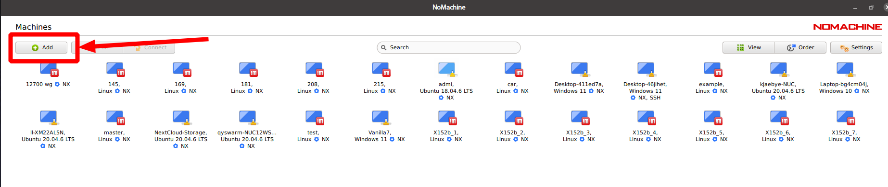

快速配置
============

.. toctree::
   :maxdepth: 2
   :caption: 目录
   :hidden:

   write_image
   version

系统账户信息
----------

X152b 的默认系统账户信息如下:

.. list-table::
   :widths: 5 30
   :align: left
   :header-rows: 1

   * - **用户名**
     - **默认密码**
   * - emnavi
     - 123456

修改无人机网络主机名、用户名及密码
-------------------

.. note::
  本示例将默认的用户名 khadas 改为 emnavi ,将默认的网络主机名 khadas 改为 X152b-ubuntu20

1、修改网络主机名

.. code-block:: bash

  sudo gedit /etc/hosts

把两个 Khadas 改成 x152b-ubuntu20

2、修改用户名

.. code-block:: bash

  sudo su
  vim /etc/passwd 找到当前用户名并修改
  vim /etc/shadow 找到当前用户名并修改
  vim /etc/group 找到所有当前用户名并修改
  reboot

重启之后就是新的用户名了，接下来更改密码，主机名，以及用户根目录名

.. code-block:: bash

  # 更改用户根目录名
  sudo mv /home/Khadas /home/emnavi
  # 更改网络主机名
  sudo hostnamectl set-hostname x152b-ubuntu20
  # 更改密码
  sudo passwd emnavi

首次连接 Wifi
-----------

.. note::
  本示例将无人机机载电脑的IP设置为 192.168.20.100

另外准备一台计算机，通过USB虚拟局域网有线直连 X152b 机载电脑。

.. warning::
    为了使虚拟网卡正常工作，在机载电脑开机前需要拔掉 RealSense D430 的数据线

如下图所示，准备两条线，分别插在对应的位置上。

* 黑色线为供电线(需要从PD充电器取电)

* 白色线为数据线，一端连接机载电脑，另一端连接另一个计算机（主机），当机载电脑上的灯由绿色转变为白色时，表明机载电脑已经开启

.. image:: ./assets/wiring.jpg
  :width: 600
  :alt: Alternative text

此时主机上会新增一个USB网卡，按下表手动对主机上的网卡进行设置

.. list-table::
   :widths: 5 30
   :align: left
   :header-rows: 1

   * - **IP**
     - **NetMask**
   * - 192.168.20.10
     - 255.255.255.0

现在就可以通过 SSH 连接至机载电脑

.. code-block:: bash

    ssh emnavi@192.168.20.100
    # 默认密码为123456

通过 SSH 建立连接之后，可以通过命令行连接 wifi ,这里使用 `nmcli` 工具配置网络,以下是常用指令

.. code-block:: bash

    # 搜索网络
    sudo nmcli device wifi list
    # 连接网络
    sudo nmcli device wifi connect 要连接的wifi名 password wifi密码
    # 查看已有的连接
    nmcli connection show
    # 删除连接
    sudo nmcli connection delete 要删除的wifi名

.. note::
    连接上 wifi 后可以通过 `ifconfig` 直接查看机载电脑无线网卡被自动分配的 IP 地址，方便下一步配置 Nomachine

首次使用 Nomachine 连接至无人机
-----------------------

.. image:: assets/nomachine_step_2.png
  :width: 800
  :alt: Alternative text

至此，你已经完成了 X152B 无人机的开箱配置，并能对其远程访问，下一步你可以进行常用算法的部署