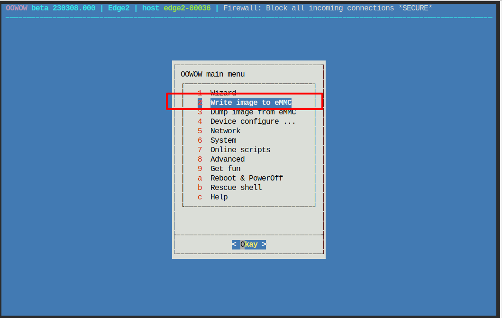
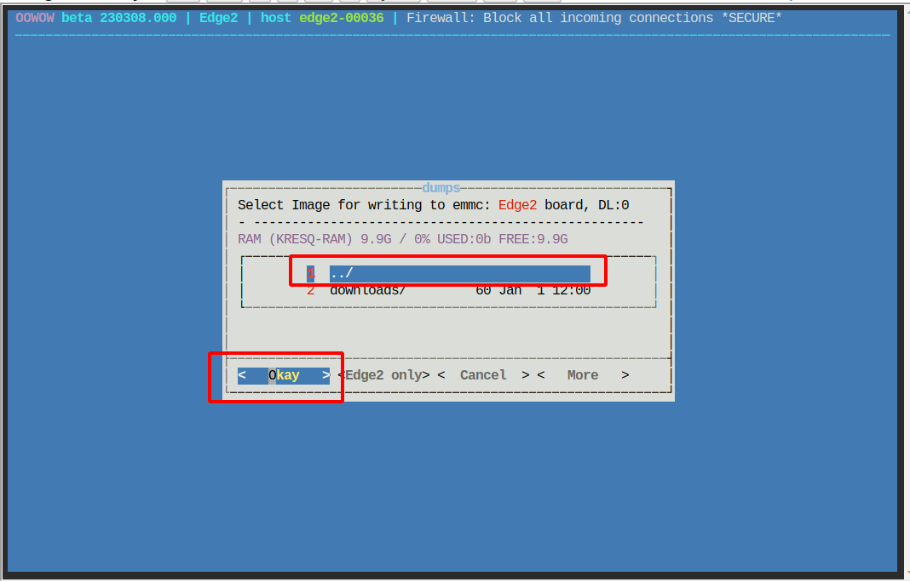
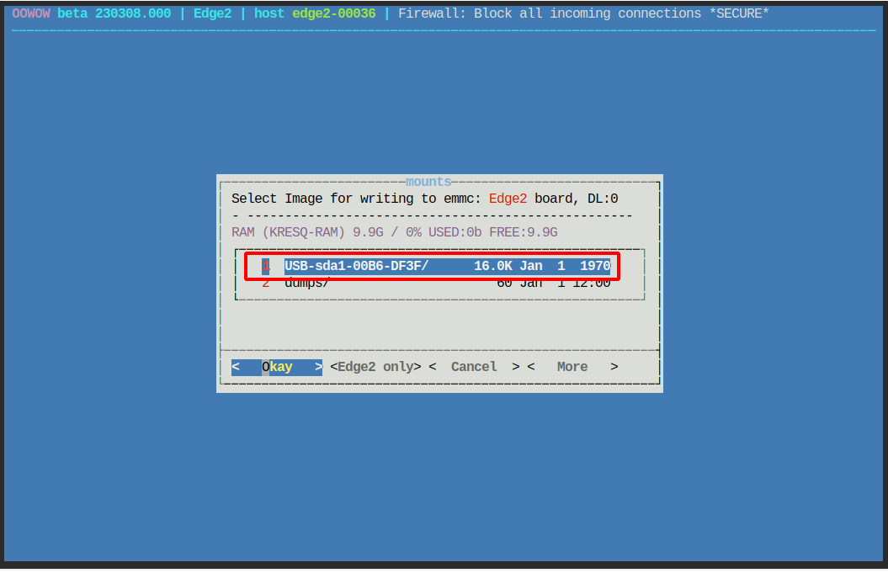
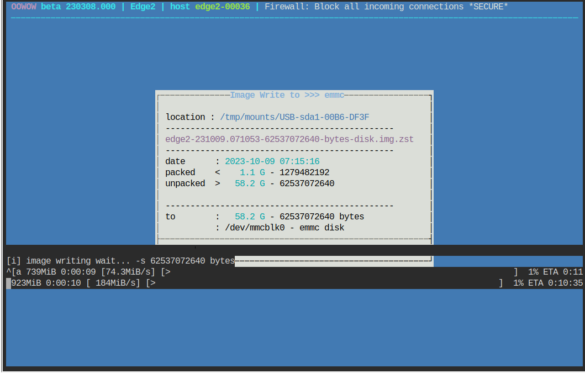

烧录系统镜像
==============================================

.. TODO(Derkai): 镜像下载地址应当提供一个可用于公共使用的
1、镜像下载： http://10.42.0.180/webdav/X-152b_image_zip/，并存放到 U 盘里，再将 U 盘插入机载电脑上。

2、用 USB 线连接另一台计算机(主机)

.. note:: 
    提前在主机通过 USB 虚拟网卡设置机载电脑自动获取IP， 本示例为 172.22.1.1

3、启动机载电脑后，按住 Function 键并短按 Reset 键进入 OOWOW 工具界面

4、在主机的浏览器中使用 http://172.22.1.1/x/control 进入控制界面，执行以下步骤：

.. TODO(Derkai):添加一张结果图
.. image:: ./assets/write_image5.png
  :width: 600
  :alt: Alternative text