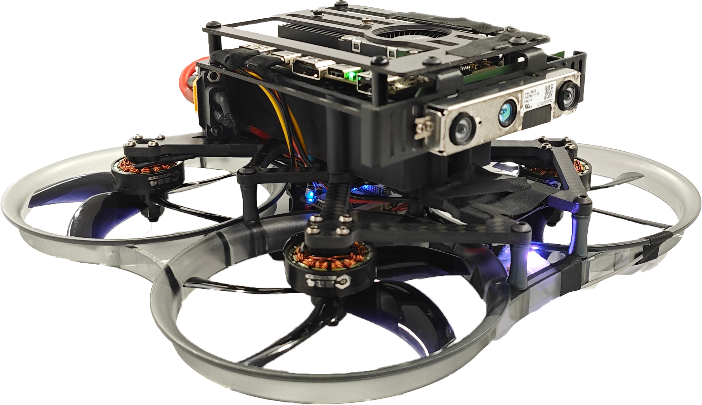

.. X152b-documatation documentation master file, created by
   sphinx-quickstart on Fri Apr 26 16:26:37 2024.
   You can adapt this file completely to your liking, but it should at least
   contain the root `toctree` directive.

emNavi-X152b 无人机应用开发文档
================

.. toctree::
   :maxdepth: 2
   :caption: 目录

   introduction/index
   prepare/index
   code_lib/index
   firmware/index

.. Indices and tables
.. ==================

.. * :ref:`genindex`
.. * :ref:`modindex`
.. * :ref:`search`

