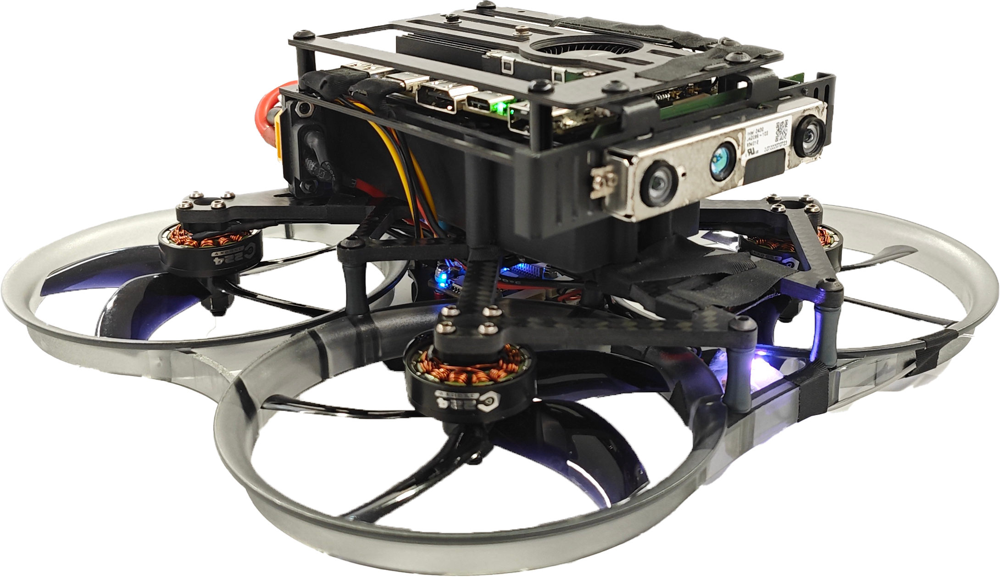
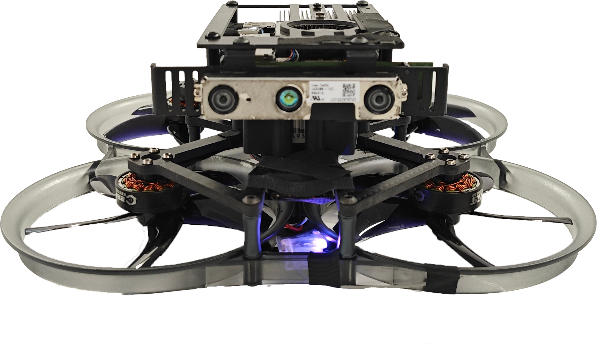

开篇介绍
=============

.. raw:: html

    

.. role:: red

.. :red:`test - this text should be red`

项目简介
---------

*Embodied Navigation* (**emNavi**) 是一项基于感知的无人机具身智能导航与控制的研究项目。旨在将最前沿的人工智能与优化方法部署于嵌入式层级的移动机器人之上。
该项目开发了无人机科研平台X152b、X660等，精简并集成了多种基于无人机平台的前沿研究算法。本文档记录了 **emNavi** 项目基于X152b型无人机的开发。

X152b平台
-------

X152b是一款集成了双目深度相机D430、轻量级机载算力平台Edge2、Mini PX4飞控、以及穿越机动力套件的自主飞行无人机。
X152b预装载了ubuntu20.04.6 LTS操作系统，并提供基于此环境的无人机感知、规划、控制、以及学习的二次开发平台。

.. image:: ./assets/X152b-top.png
    :width: 600
    :alt: Alternative text

文档组织
-------
本网站分为三个部分，主要内容概括如下：

- 基础配置：介绍X152b的几种连接方式，以帮助用户扩展更丰富的功能。

- 算法库：本章节介绍基于X152b的前沿开源算法部署方法。该部分将会随着我们对更多算法的优化与适配而不断扩充。

- 系统及固件设置：介绍预装载操作系统、版本修改情况、以及各种硬件相关设置。

