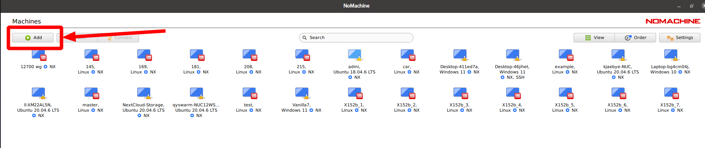

基础配置
==============================================

连接方式
----------

X152b 的默认账户信息如下:

* 用户名: emnavi
* 默认密码: 123456

连接至新wifi
-----------

X152b提供通过USB虚拟局域网连接有线直连pc的方法,

.. warning::
    为了使虚拟网卡正常工作，在机载电脑开机前需要拔掉realsense的usb数据线

如下图所示黑色线为供电线(需要从PD充电器去电)，白色线一端连接机载电脑，另一端连接任意一个电脑(主机)，当电脑上的灯由绿色转变为白色时，电脑已经开启

.. image:: ./assets/wiring.jpg
  :width: 600
  :alt: Alternative text

此时主机上会新增一个USB网卡，对主机上的网卡进行设置

* ip : 192.168.20.10
* netmask: 255.255.255.0
* 其他不设置

现在可以通过ssh 连接至机载电脑

.. code-block:: bash

    ssh qyswarm@192.168.20.100
    # 默认密码为123456

通过ssh建立连接之后，可以通过命令行切换网络,这里介绍通过nmcli配置网络的方法,以下是常用指令

.. code-block:: bash

    # 搜索网络
    sudo nmcli device wifi list
    # 连接网络
    sudo nmcli device wifi connect 要连接的wifi名 password wifi密码
    # 查看已有的连接
    nmcli connection show
    # 删除连接
    sudo nmcli connection delete 要删除的wifi名

.. note::
    连接上wifi后可以通过ifconfig直接查看无线网卡被自动分配的ip地址，方便下一步配置Nomachine

使用Nomachine 连接至无人机
-----------------------

.. image:: assets/nomachine_step_2.png
  :width: 800
  :alt: Alternative text

修改无人机用户名及密码
-------------------

.. note::
    TODO

host 的修改如下

.. code-block:: bash

  sudo gedit /etc/hosts

把两个 Khadas 改成 x152b-ubuntu20

.. image:: ./assets/change_host.png
  :width: 600
  :alt: Alternative text

用户名更改

默认用户名为qyswarm，密码是123456

https://blog.nowcoder.net/n/525cc83df73448a0909cb2a0c286df72

.. note::
  示例中 ： khadas 是 oldName, qyswarm 是 newName,X152b-ubuntu20 是newHostName

.. code-block:: bash

  sudo su
  vim /etc/passwd 找到当前用户名并修改
  vim /etc/shadow 找到当前用户名并修改
  vim /etc/group 找到所有当前用户名并修改
  '可以使用 : %/oldName/newName/g 完成替换'
  reboot

现在重启就是新的用户名了，接下来更改密码，主机名，以及用户根目录名

.. code-block:: bash
  # 更改用户根目录名
  sudo mv /home/oldName /home/newName
  # 更改主机名
  sudo hostnamectl set-hostname newHostName
  # 更改密码
  sudo passwd newName

更改Logo
--------

更改登录Logo

在 `/etc/update-motd.d/00-header`中

.. code-block:: bash
  #!/bin/bash

  KERNEL_VER=$(uname -r)

  . /etc/os-release
  . /etc/fenix-release

  printf "\nWelcome to \e[0;91mFenix\x1B[0m %s %s %s\n" "$VERSION $PRETTY_NAME Linux $KERNEL_VER"

  # TERM=linux toilet -f standard -F metal "Khadas $BOARD"
  # X-152b 的位置就是会显示大logo的地方
  TERM=linux toilet -f standard -F metal "X-152b"

  if cat /proc/cmdline | grep -q reboot_test; then
          TERM=linux toilet -f standard -F metal "REBOOT TEST"
  fi

效果如下

换源
-----

apt

这里以清华源为例  :ref:`my-reference-label` .

.. code-block:: bash

  # 默认注释了源码镜像以提高 apt update 速度，如有需要可自行取消注释
  deb https://mirrors.tuna.tsinghua.edu.cn/ubuntu-ports/ focal main restricted universe multiverse
  # deb-src https://mirrors.tuna.tsinghua.edu.cn/ubuntu-ports/ focal main restricted universe multiverse
  deb https://mirrors.tuna.tsinghua.edu.cn/ubuntu-ports/ focal-updates main restricted universe multiverse
  # deb-src https://mirrors.tuna.tsinghua.edu.cn/ubuntu-ports/ focal-updates main restricted universe multiverse
  deb https://mirrors.tuna.tsinghua.edu.cn/ubuntu-ports/ focal-backports main restricted universe multiverse
  # deb-src https://mirrors.tuna.tsinghua.edu.cn/ubuntu-ports/ focal-backports main restricted universe multiverse

  deb https://mirrors.tuna.tsinghua.edu.cn/ubuntu-ports/ focal-security main restricted universe multiverse
  # deb-src https://mirrors.tuna.tsinghua.edu.cn/ubuntu-ports/ focal-security main restricted universe multiverse

  # deb http://ports.ubuntu.com/ubuntu-ports/ focal-security main restricted universe multiverse
  # # deb-src http://ports.ubuntu.com/ubuntu-ports/ focal-security main restricted universe multiverse

  # 预发布软件源，不建议启用
  # deb https://mirrors.tuna.tsinghua.edu.cn/ubuntu-ports/ focal-proposed main restricted universe multiverse
  # # deb-src https://mirrors.tuna.tsinghua.edu.cn/ubuntu-ports/ focal-proposed main restricted universe multiverse

.. _my-reference-label: https://mirrors.tuna.tsinghua.edu.cn/help/ubuntu-ports/
