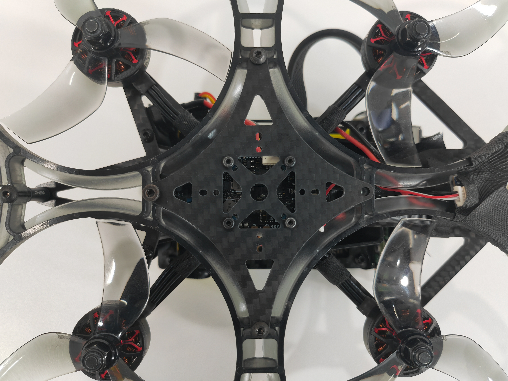
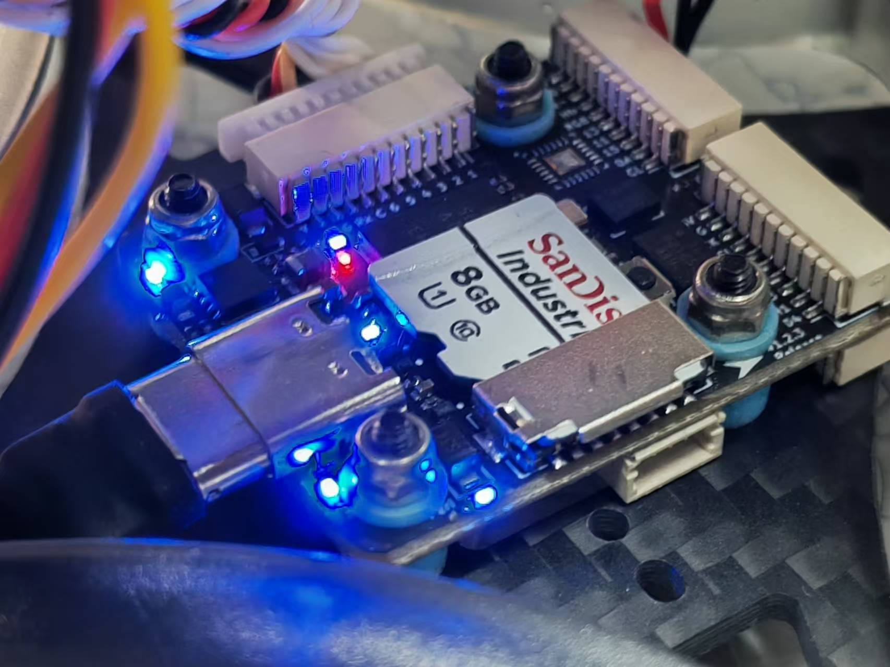
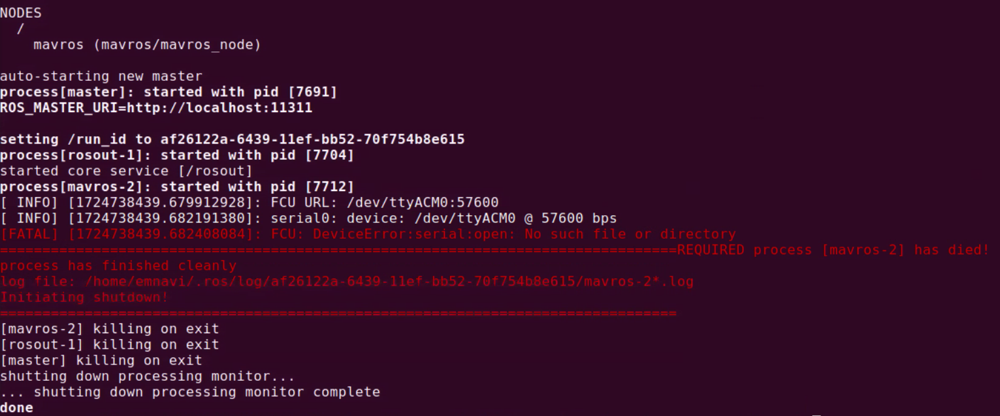
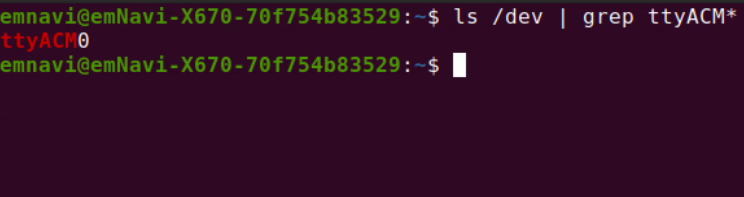
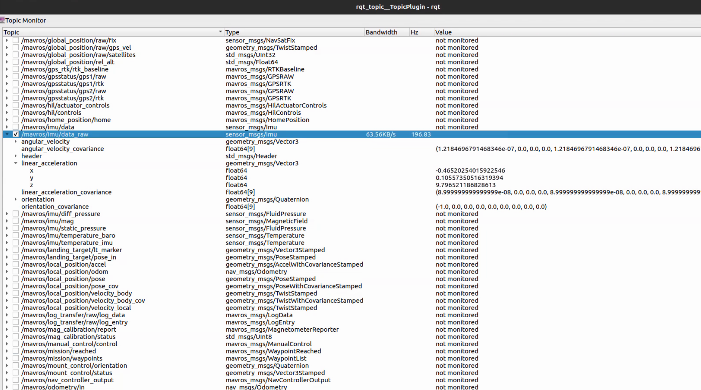

飞控问题排查
---------------------------

可参考如下步骤进行完整的飞控问题检查：

1、检查飞控固定螺丝有无明显松动。

2、检查飞控指示灯是否正常亮，飞控线缆是否插牢、是否出现损伤、焊点是否虚接脱落。

3、检查是否能收到飞控数据。

.. code-block:: bash

  # 进入无人机电脑终端，开启 mavros 连接到飞控（FCU）
  roslaunch mavros px4.launch fcu_url:=/dev/ttyACM0:115200

若提示 `FCU: DeviceError:serial:open: No such file or directory` ，则说明连接Mavros连接飞控失败，可检查下列两项

4、检查是否能识别到飞控设备号。

.. code-block:: bash

  # 进入无人机电脑终端，若能识别，则会显示出一个名为 ttyACM0 的设备文件
  ls /dev | grep ttyACM*

5、是否存在文件权限问题。

.. code-block:: bash

  # 授予权限
  sudo chmod +X /dev/ttyACM0

6、FCU连接地址或端口是否存在占用。

若能连接到飞控且没有异常报错，检查 imu 相关话题是否正常
~~~~~~~~~~~~~~~~~~~~~~~~~~~~~~~~~

.. code-block:: bash

  # 查看指定话题
  rostopic echo /mavros/imu/data_raw

  # 可视化查看全部话题
  rqt_topic

正常结果如上图所示， mavros 话题详细说明可参考下表：